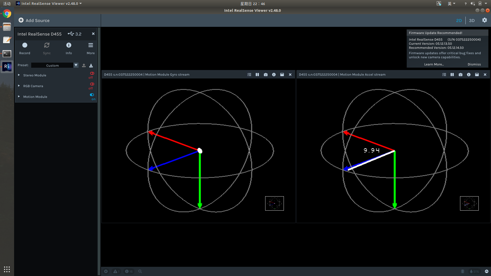

# hao_calibration
自己用的一些标定方法（ROS自带，Kalibr，深蓝标定方法）及步骤整理。

## 01 ROS自带棋盘格标定

http://wiki.ros.org/camera_calibration

ROS提供了camera_calibration Package：[image_pipeline](https://github.com/ros-perception/image_pipeline)，通过这个Package可以使用棋盘标定板对单目和双目相机进行标定。

ROS官方提供了用于单目或者[双目标定](https://so.csdn.net/so/search?q=双目标定&spm=1001.2101.3001.7020)的camera_calibration包。这个包是使用opencv里的张正友标定法。

- apt安装

```
sudo apt-get install ros-melodic-camera-calibration
```

- 源码编译

```
cd catkin_ws/src   
git clone  https://github.com/ros-perception/image_pipeline.git   
cd image_pipeline
git checkout melodic
cd ..   
rosdep install --from-paths src --ignore-src   # 安装image_pipeline 所需的依赖 
catkin_make
source devel/setup.bash 
```

启动相机节点

```
roslaunch usb_cam usb_cam-test.launch 
```

```
rostopic echo /camera_info    //未标定过的相机应该都是0
```

使用棋盘格进行标定

```
rosrun camera_calibration cameracalibrator.py --size 11x8 --square 0.03 image:=/usb_cam/image_raw camera:=/usb_cam
```

此命令运行标定结点的python脚本，其中 ：
（1）–size 6x7 为当前标定板的大小，注意最外圈不算
（2）–square 0.108为每个棋盘格的边长
（3）image:=/camera/image_raw标定当前订阅图像来源自名为/camera/image_raw的topic
（4）camera:=/camera为摄像机名，（即在/image_raw前面部分）


转动相机，前后左右上下，旋转直至出现CALIBRATE变绿


点击SAVE，会保存到/tmp/calibrationdata.tar.gz中，但其实终端中也会显示相关相机的参数

```
D = [0.15680997193139762, -0.14754101608023112, 0.0009861478574651069, -0.0031992630174512197, 0.0]
K = [482.1544048292113, 0.0, 296.7130720175566, 0.0, 481.268628788655, 263.84325136526644, 0.0, 0.0, 1.0]
R = [1.0, 0.0, 0.0, 0.0, 1.0, 0.0, 0.0, 0.0, 1.0]
P = [502.2211608886719, 0.0, 294.5855137996459, 0.0, 0.0, 502.6645812988281, 264.4662673777475, 0.0, 0.0, 0.0, 1.0, 0.0]
None
oST version 5.0 parameters
[image]
width
640
height
480
[narrow_stereo]
camera matrix
482.154405 0.000000 296.713072
0.000000 481.268629 263.843251
0.000000 0.000000 1.000000
distortion
0.156810 -0.147541 0.000986 -0.003199 0.000000
rectification
1.000000 0.000000 0.000000
0.000000 1.000000 0.000000
0.000000 0.000000 1.000000
projection
502.221161 0.000000 294.585514 0.000000
0.000000 502.664581 264.466267 0.000000
0.000000 0.000000 1.000000 0.000000
```

将ost.txt文件改名为ost.ini，并使用camera_calibration_parsers功能包的convert节点创建相机参数文件（camera.yaml）。创建完成后，将其保存在~/.ros/camera_info/目录中，则ROS中使用的相机相关功能包会引用此信息

```powershell
cd /tmp
```

将ost.txt文件改名为ost.ini

```powershell
mv ost.txt ost.ini 
```

使用camera_calibration_parsers功能包的convert节点创建相机参数文件（camera.yaml）

```powershell
rosrun camera_calibration_parsers convert  ost.ini camera.yaml
```

在~/.ros/ 下创建 camera_info目录

```powershell
mkdir ~/.ros/camera_info 
```

将camera.yaml其保存在~/.ros/ camera_info/目录中

```powershell
mv camera.yaml ~/.ros/camera_info/
```

此时

```
rostopic echo /camera_info 
```


双目相机标定例子

```
source ./wrappers/ros/devel/setup.bash
roslaunch mynteye_wrapper_d display.launch 
```

```
rosrun camera_calibration cameracalibrator.py --size 7x6 --square 0.108 --no-service-check --approximate=0.1 right:=/right/image_raw_color left:=/left/image_raw_color right_camera:=/mynteye/right 　　left_camera:=/mynteye/left
```


## 02 Kalibr标定

[Kalibr](https://github.com/ethz-asl/kalibr)，可以实现Multiple camera calibration、Camera-IMU calibration、Rolling Shutter Camera calibration。

### 1. 安装realsense-SDK

#### 1.1 使用指令安装（如果不需要校准IMU可以用这个方式安装）

[官方教程](https://github.com/IntelRealSense/librealsense/blob/master/doc/distribution_linux.md)
注册服务器的公钥

```
hao007@hao007:~$ sudo apt-key adv --keyserver keyserver.ubuntu.com --recv-key F6E65AC044F831AC80A06380C8B3A55A6F3EFCDE || sudo apt-key adv --keyserver hkp://keyserver.ubuntu.com:80 --recv-key F6E65AC044F831AC80A06380C8B3A55A6F3EFCDE
Executing: /tmp/apt-key-gpghome.TLTbIySyuu/gpg.1.sh --keyserver keyserver.ubuntu.com --recv-key F6E65AC044F831AC80A06380C8B3A55A6F3EFCDE
gpg: 密钥 C8B3A55A6F3EFCDE：公钥“"CN = Intel(R) Intel(R) Realsense", O=Intel Corporation”已导入
gpg: 合计被处理的数量：1
gpg:               已导入：1
```

如果无法检索到公钥可以设置代理：`export http_proxy="http://<proxy>:<port>"`
将服务器添加到存储列表
`sudo add-apt-repository "deb https://librealsense.intel.com/Debian/apt-repo $(lsb_release -cs) main" -u`
安装库

```
sudo apt-get install librealsense2-dkms
sudo apt-get install librealsense2-utils
```

开发包（可选）

```
sudo apt-get install librealsense2-dev
sudo apt-get install librealsense2-dbg
```

验证，打开一个终端输入`realsense-viewer`看这个软件能否打开


#### 1.2 使用源码安装（后续可以用里面的包校准IMU）

安装地址，选择[最新版](https://github.com/IntelRealSense/librealsense)
[官方安装教程](https://github.com/IntelRealSense/librealsense/blob/master/doc/installation.md)
我个人装在了~/software/下

```
cd librealsense
sudo apt-get install git libssl-dev libusb-1.0-0-dev libudev-dev pkg-config libgtk-3-dev
sudo apt-get install libglfw3-dev libgl1-mesa-dev libglu1-mesa-dev at
./scripts/setup_udev_rules.sh
./scripts/patch-realsense-ubuntu-lts.sh
echo 'hid_sensor_custom' | sudo tee -a /etc/modules

sudo add-apt-repository ppa:ubuntu-toolchain-r/test
sudo apt-get update
sudo apt-get install gcc-5 g++-5
sudo update-alternatives --install /usr/bin/gcc gcc /usr/bin/gcc-5 60 --slave /usr/bin/g++ g++ /usr/bin/g++-5
sudo update-alternatives --set gcc "/usr/bin/gcc-5"

mkdir build && cd build
cmake ../
sudo make uninstall && make clean && make && sudo make install
```

使用D455相机的原装usb线到电脑(接口最好是usb3.0,否则可能导致数据传输过慢而使得数据无法实时传输，出现画面卡住的现象)

打开一个终端输入`realsense-viewer`看这个软件能否打开来验证是否成功安装。我们通过左边的选项打开imu，双目和rgb相机模块，同时可以查看各个模块的参数并进行设置
图示是在419


#### 1.3 IMU校准

我们首先要看一下相机的加速度在静置的时候是不是正常的，正常的话我们加速度计的g_norm: 9.82左右（可以打开realsense-viewer，相机处于正常拍摄视角。开启Motion Module 鼠标放在Accel上面查看）



如果不正常，例如我校准前的g_norm为9.94左右，则进行以下校准过程：
使用SDK中的官方那个工具校准IMU
首先安装一个包`pip install pyrealsense2`
校准工具的位置在/home/hao007/libsense_install/librealsense/tools/rs-imu-calibration
输入`python rs-imu-calibration.py`
运行该脚本后从6个位置获取IMU 数据， 在每个位置停留3-4秒时间。
具体操作如下：


我和官方文档的人一样制作了一个简易盒子来实现90度的翻转。
方位如下：


校准完之后发现加速度计的值变成9.85左右，恢复正常。注意在查看g_norm大小的时候，需要让相机上下正放，也就是正常拍摄视角。


### 2. 下载安装realsense-ROS

[官网](https://github.com/IntelRealSense/realsense-ros)
补充安装`sudo apt-get install ros-melodic-ddynamic-reconfigure`
创建工作空间

```
cd ~/hao_camera_launch/src/
```

下载源码

```
git clone https://github.com/IntelRealSense/realsense-ros.git
cd realsense-ros/
git checkout `git tag | sort -V | grep -P "^2.\d+\.\d+" | tail -1`
cd ..
```

编译

```
catkin_init_workspace
cd ..
catkin_make clean
catkin_make -DCATKIN_ENABLE_TESTING=False -DCMAKE_BUILD_TYPE=Release
catkin_make install
```

添加环境变量

```
echo "source ~/hao_camera_launch/devel/setup.bash" >> ~/.bashrc
source ~/.bashrc
```

### 3. 标定相机和IMU

我们将使用kalibr对相机进行标定，使用code_utils和imu_utils对imu进行标定

#### 3.1 下载编译Kalibr

1. 下载源文件并编译
   官方地址https://github.com/ethz-asl/kalibr
   安装教程https://github.com/ethz-asl/kalibr/wiki/installation
   pre_environment

```
sudo apt-get install -y \
    git wget autoconf automake nano \
    libeigen3-dev libboost-all-dev libsuitesparse-dev \
    doxygen libopencv-dev \
    libpoco-dev libtbb-dev libblas-dev liblapack-dev libv4l-dev
```

```
sudo apt-get install -y python3-dev python-pip python-scipy \
    python-matplotlib ipython python-wxgtk4.0 python-tk python-igraph
```

创建工作空间(这一步之前你得把ros装好,同时将opencv3.2配置好)
安装ros参考[链接](http://wiki.ros.org/melodic/Installation/Ubuntu)

```
安装ros，已装好的可以跳过
sudo sh -c 'echo "deb http://packages.ros.org/ros/ubuntu $(lsb_release -sc) main" > /etc/apt/sources.list.d/ros-latest.list'
sudo apt install curl
curl -s https://raw.githubusercontent.com/ros/rosdistro/master/ros.asc | sudo apt-key add -
sudo apt update
sudo apt install ros-melodic-desktop-full
echo "source /opt/ros/melodic/setup.bash" >> ~/.bashrc
source ~/.bashrc
sudo apt install python-rosdep python-rosinstall python-rosinstall-generator python-wstool build-essential
sudo apt install python-rosdep
sudo rosdep init
rosdep update
```

继续

```
sudo apt-get install python-catkin-tools
mkdir -p ~/software/kalibr_workspace/src
cd ~/software/kalibr_workspace
export ROS1_DISTRO=melodic # kinetic=16.04, melodic=18.04, noetic=20.04
source /opt/ros/$ROS1_DISTRO/setup.bash
catkin init
catkin config --extend /opt/ros/$ROS1_DISTRO
catkin config --merge-devel # Necessary for catkin_tools >= 0.4.
catkin config --cmake-args -DCMAKE_BUILD_TYPE=Release
```

下载工程包

```
cd ~/software/kalibr_workspace/src
git clone https://github.com/ethz-asl/kalibr.git
```

编译kalibr

```
cd ~/software/kalibr_workspace/
catkin build -DCMAKE_BUILD_TYPE=Release -j4
```

#### 3.2 下载编译code_utils

创建ros工作空间，用于code_utils以及后面的imu_utils，工作空间名和路径可以自己更改在。在software下的d455calib里面，/home/fcl/software/d455calib/imucalib_ws/src下放两个文件code_utils和imu_utils

1. 创建工作空间

```
mkdir -p ~/software/d455calib/imu_catkin_ws/src
cd ~/software/d455calib/imu_catkin_ws/src
catkin_init_workspace
cd ..
catkin_make
source ~/software/d455calib//imu_catkin_ws/devel/setup.bash
```

2. 下载编译code_utils

```
cd ~/software/d455calib/imu_catkin_ws/src
git clone git@github.com:gaowenliang/code_utils.git(这一步可以直接复制手动下载解压好了的code_utils-master)
cd ..
catkin_make
```

我遇到的两个错误以及解决办法如下：
catkin_make时出现libdw.h没有找到
`sudo apt-get install libdw-dev`
catkin_make时出现backward.hpp没有找到
`将sumpixel_test.cpp中# include "backward.hpp"改为：#include “code_utils/backward.hpp”`

#### 3.3 下载编译imu_utils

```
cd ~/software/d455calib/imu_catkin_ws/src/
git clone git@github.com:gaowenliang/imu_utils.git(直接复制手动下载解压的imu_utils-master)
cd ..
catkin_make
```

#### 3.4 IMU标定

1. 修改launch文件
   找到realsense-ros包，进入/home/fcl/software/rs-ros-wrapper/catkin_ws/src/realsense-ros-development/realsense2_camera/launch，复制其中的rs_camera.launch，并重命名为rs_camera_imucalib.launch，并对里面的内容做如下更改
   这样做的目的是将accel和gyro的数据合并得到imu话题，如不这样做发布的topic中只有加速计和陀螺仪分开的topic，没有合并的camera/imu topic，并且让accel和gyro都设置成true

```
<arg name="unite_imu_method"          default="linear_interpolation"/>
```

2. 运行启动文件
   `roslaunch realsense2_camera rs_camera_imucalib.launch`
3. 编写启动文件
   进入/software/d455calib/imucalib_ws/src/imu_utils-master/launch，打开终端运行
   `gedit d455_imu_calibration.launch`
   在里面写入

```
<launch>

    <node pkg="imu_utils" type="imu_an" name="imu_an" output="screen">
    	<!--TOPIC名称和上面一致-->
        <param name="imu_topic" type="string" value= "/camera/imu"/>
        <!--imu_name 无所谓-->
        <param name="imu_name" type="string" value= "d455"/>
        <!--标定结果存放路径-->
        <param name="data_save_path" type="string" value= "$(find imu_utils)/data/"/>
        <!--数据录制时间-min-->
        <param name="max_time_min" type="int" value= "50"/>
        <!--采样频率，即是IMU频率，采样频率可以使用rostopic hz /camera/imu查看，设置为200，为后面的rosbag play播放频率-->
        <param name="max_cluster" type="int" value= "200"/>
    </node>

</launch>
```

这里师弟们要注意可以把data文件夹修改为你们自己创建的文件夹，但是你要先创建文件夹，系统不好根据launch文件自动创建你写的文件夹，否则就没有标定的结果文件产生

4. 录制imu数据包
   realsense静止放置，放置时间要稍大于d455_imu_calibration.launch中的录制时间，即大于50分钟`rosbag record -O imu_calibration /camera/imu`
   其中imu_calibration是bag包的名字，可以更改，录的包在当前终端目录下
   /camera/imu是发布的IMU topic，可以通`rostopic list`命令查看
5. 校准程序
   包录制好之后，运行校准程序，首先激活imu_util工作空间的setup.bash
   `source /home/fcl/software/d455calib/imucalib_ws/devel/setup.bash`
   然后
   `roslaunch imu_utils d455_imu_calibration.launch`
   回放数据包
   打开新的终端，cd到存放imu_calibration.bag的路径

```
cd ~/data/dataset/IMU标定录制的大于50min的包
rosbag play -r 200 imu_calibration.bag
```

标定结束后在/home/fcl/software/d455calib/imucalib_ws/src/imu_utils-master/data中生成许多文件，其中d455_imu_param.yaml就是我们想要的结果，展示如下,作为对比，realsense自带的参数都是0，d455_imu_param.yaml文件内容如下：

```
%YAML:1.0
---
type: IMU
name: d455
Gyr:
   unit: " rad/s"
   avg-axis:
      gyr_n: 1.8120078954292167e-03
      gyr_w: 1.9468192818602672e-05
   x-axis:
      gyr_n: 1.7014503941873895e-03
      gyr_w: 1.8929622045590070e-05
   y-axis:
      gyr_n: 2.0863033939625092e-03
      gyr_w: 2.6649319246466860e-05
   z-axis:
      gyr_n: 1.6482698981377512e-03
      gyr_w: 1.2825637163751080e-05
Acc:
   unit: " m/s^2"
   avg-axis:
      acc_n: 1.8783286176747332e-02
      acc_w: 8.8271097542303530e-04
   x-axis:
      acc_n: 1.9176496923914592e-02
      acc_w: 1.2650034452525252e-03
   y-axis:
      acc_n: 1.7240711086239993e-02
      acc_w: 7.3690326844879966e-04
   z-axis:
      acc_n: 1.9932650520087410e-02
      acc_w: 6.4622621256778061e-04
```

#### 3.5 双目相机标定

1. 标定板
   下载打印[标定板](https://github.com/ethz-asl/kalibr/wiki/downloads)
   下载Aprilgrid 6*6 0.8*0.8m(unscaled)，记住要缩放到40%，才能用A4纸就可以打印出来
   原始pdf的格子参数是：

```
6*6的格子
大格子边长：5.5cm
小格子边长：1.65cm
小格子与大格子边长比例：0.3
```

调整后的格子参数是：

```
大格子边长：2.1cm(我的经过实际测量是2.1)，一定要自己测量大格子边长，即tagSize
小格子边长：0.66cm
小格子与大格子边长比例：0.3
```

但这只是理想情况，实际情况还得实际测量。
新建april_6x6_A4.yaml文件，在/home/fcl/software/d455calib/multicalib_yaml_data/april_6x6_A4.yaml文件里我设置的内容如下：

```
target_type: 'aprilgrid' #gridtype
tagCols: 6               #number of apriltags
tagRows: 6               #number of apriltags
tagSize: 0.021           #size of apriltag, edge to edge [m]
tagSpacing: 0.3          #ratio of space between tags to tagSize
```

2. 手动关闭结构光
   默认开始结构光时，双目图像会有很多点，这些点可能对标定有影响，所以使用时需要关闭结构光。
   方法一：先启动符合你需要的配置的launch文件，例如 roslaunch realsense2_camera rs_camera.launch新打开终端，运行rosrun rqt_reconfigure rqt_reconfigure打开后将camera->stereo_module中的emitter_enabled设置为off(0) ，可以通过肉眼看相机发射器已经不再发射IR光了，展示如下
   
   方法二：realsense-viewer，打开双目模块的下拉选项，关闭结构光Emitter Enabled Off
3. 开始录制.bag文件
   第一步：将realsense对准标定板放置
   `roslaunch realsense2_camera rs_camera_stereocalib.launch` 
   运行rviz，fixed frame选择camera_link，之后在里面add rgb和双目对应的topic，三个相机在realsense上是一样大小的，彩色/camera/color/image_raw、左目/camera/infra1/image_rect_raw、右目/camera/infra2/image_rect_raw展示如下：

第二步：修改相机帧数（官方推荐是4Hz，尽管实际频率不完全准确，但是不影响结果)kalibr在处理标定数据的时候要求频率不能太高，一般为4Hz，我们可以使用如下命令来更改topic的频率，实际上是将原来的topic以新的频率转成新的topic，经过我实际测试infra1才是对应的左目相机

```
rosrun topic_tools throttle messages /camera/color/image_raw 4.0 /color
rosrun topic_tools throttle messages /camera/infra1/image_rect_raw 4.0 /infra_left
rosrun topic_tools throttle messages /camera/infra2/image_rect_raw 4.0 /infra_right
```

新出现的topic如下

注意：这种方式可能导致不同摄像头的时间不同步，如果出现这个问题，可以尝试不做这个操作，不这样做意味着需要更多的处理时间，这样的话后面也要相应的更改。可以使用rqt或者rostopic hz 查看是不是设置频率成功。
查看频率

第三步：之后对准标定板，尝试移动realsense，同时要确保标定板一直在三个图像当中。
录制过程[参考](https://www.youtube.com/watch?v=puNXsnrYWTY&app=desktop)科学上网观看
总结下来就是偏航角左右摆动3次，俯仰角摆动3次，滚转角摆动3次，上下移动3次，左右移动3次，前后移动3次，然后自由移动一段时间，摆动幅度要大一点，让视角变化大一点，但是移动要缓慢一点，同时要保证标定板在3个相机视野内部，整个标定时间要在90s以上更好

录制ROS数据包
`rosbag record -O multicameras_calibration /infra_left /infra_right /color`
后面三个topic就是转换频率后的topic

4. 使用Kalibr标定
   第一步：先激活环境变量
   `source software/kalibr_ws/devel/setup.bash `
   第二步：运行标定指令
   `kalibr_calibrate_cameras --target /home/fcl/software/d455calib/multicalib_yaml_data/april_6x6_A4.yaml --bag  /home/fcl/software/d455calib/multicalib_yaml_data/multicameras_calibration.bag --models pinhole-radtan pinhole-radtan pinhole-radtan --topics /infra_left /infra_right /color --bag-from-to 3 157 --show-extraction --approx-sync 0.04`
   其中
   april_6x6_A4.yaml是标定板的配置文件
   multicameras_calibration.bag 是录制的数据包
   models pinhole-radtan pinhole-radtan pinhole-radtan表示三个摄像头的相机模型和畸变模型
   --topics /infra_left /infra_right /color表示三个摄像头对应的拍摄的数据话题
   –-bag-from-to 3 157表示处理bag中3-157秒的数据
   –show-extraction表示显示检测特征点的过程，这些参数可以相应的调整。
   可以使用rosbag info 来参看录制的包的信息

```
fcl@fcl-ThinkPad-T480:~/software/d455calib/multicalib_yaml_data$ rosbag info multicameras_calibration.bag 
path:        multicameras_calibration.bag
version:     2.0
duration:    2:41s (161s)
start:       Jul 19 2021 13:44:55.21 (1626673495.21)
end:         Jul 19 2021 13:47:36.87 (1626673656.87)
size:        1.9 GB
messages:    1754
compression: none [1169/1169 chunks]
types:       sensor_msgs/Image [060021388200f6f0f447d0fcd9c64743]
topics:      /color         584 msgs    : sensor_msgs/Image
             /infra_left    585 msgs    : sensor_msgs/Image
             /infra_right   585 msgs    : sensor_msgs/Image
fcl@fcl-ThinkPad-T480:~/software/d455calib/multicalib_yaml_data$ 
```

第三步：排查错误1
出现以下报错：cannot import name NavigationToolbar2Wx
解决办法：发现 matplotlib 中没有NavigationToolbar2Wx 而是换成了NavigationToolbar2WxAgg 所以修改源码，将PlotCollection.py中的NavigationToolbar2Wx换成NavigationToolbar2WxAgg
catkin_make一下
第四步：排查错误2

```
ImportError: No module named igraph
fcl@fcl-ThinkPad-T480:~$ sudo apt-get install python-igraph
```

第五步：排查错误3
报错找不到焦距，手动输入焦距，400
在终端输入

```
fcl@fcl-ThinkPad-T480:~$ source ~/software/kalibr_ws/devel/setup.bash 
fcl@fcl-ThinkPad-T480:~$ export KALIBR_MANUAL_FOCAL_LENGTH_INIT=1
fcl@fcl-ThinkPad-T480:~$ kalibr_calibrate_cameras --target /home/fcl/software/d455calib/multicalib_yaml_data/april_6x6_A4.yaml --bag  /home/fcl/software/d455calib/multicalib_yaml_data/multicameras_calibration.bag --models pinhole-radtan pinhole-radtan pinhole-radtan --topics /infra_left /infra_right /color --bag-from-to 3 157 --show-extraction --approx-sync 0.04
```

最终产生3个文件

#### 3.6 双目相机和IMU的标定

1. 复制上面双目标定结果产生的camchain-homefclsoftwared455calibmulticalib_yaml_datamulticameras_calibration.yaml文件为chain.yaml
   其中T_cn_cnm1:表示的是左目相机到右目相机的旋转和平移
2. 新建一个文件imu.yaml，参考上面imu标定步骤得到的d455_imu_param.yaml，选取其中的

```
   avg-axis:
      gyr_n: 1.8120078954292167e-03
      gyr_w: 1.9468192818602672e-05
   avg-axis:
      acc_n: 1.8783286176747332e-02
      acc_w: 8.8271097542303530e-04
```

最后得到的imu.yaml如下

```
#Accelerometers
accelerometer_noise_density: 1.8783286176747332e-02  #Noise density (continuous-time)
accelerometer_random_walk:   8.8271097542303530e-04   #Bias random walk

#Gyroscopes
gyroscope_noise_density:     1.8120078954292167e-03   #Noise density (continuous-time)
gyroscope_random_walk:       1.9468192818602672e-05  #Bias random walk

rostopic:                    /imu      #the IMU ROS topic
update_rate:                 200.0      #Hz (for discretization of the values above)
```

3. 同样需要用到april_6x6_A4.yaml
4. 复制realsense-ros包中rs_camera.launch，重命名为rs_camera_imucamcalib.launch，更改内容如下
   imu和双目数据时间对齐`<arg name="enable_sync"               default="true"/>`
   合并加速计和陀螺仪的topic`<arg name="unite_imu_method"          default="linear_interpolation"/>`
5. 启动realsense
   `roslaunch realsense2_camera rs_camera_imucamcalib.launch`
6. 关闭IR结构光
7. 打开rviz，add imu topic和infra1 topic以及infra2 topic和color topic，同时调整realsense位置，要确保双目图像数据一直包含标定板全部内容
8. 调整imu和双目topic和color的发布频率以及以新的topic名发布它们，其中双目图像的发布频率改为20Hz，imu发布频率改为200Hz

```
rosrun topic_tools throttle messages /camera/infra1/image_rect_raw 20.0 /infra_left
rosrun topic_tools throttle messages /camera/infra2/image_rect_raw 20.0 /infra_right
rosrun topic_tools throttle messages /camera/imu 200.0 /imu
rosrun topic_tools throttle messages /camera/color/image_raw 20.0 /color
```

这种调整频率的方式只是理想结果，通过rostopic hz topic名可以查看实际的频率，可以发现实际频率和设置的频率并不一定相同

9. 和上面一样开始采集数据包
   `rosbag record -O imu_stereo.bag /infra_left /infra_right /imu /color`
   查看bag包内容

```
fcl@fcl-ThinkPad-T480:~/software/d455calib/imu_stereo_data$ rosbag info imu_stereo.bag 
path:        imu_stereo.bag
version:     2.0
duration:    2:08s (128s)
start:       Jul 19 2021 16:33:19.32 (1626683599.32)
end:         Jul 19 2021 16:35:28.10 (1626683728.10)
size:        6.4 GB
messages:    7868
compression: none [3833/3833 chunks]
types:       sensor_msgs/Image [060021388200f6f0f447d0fcd9c64743]
             sensor_msgs/Imu   [6a62c6daae103f4ff57a132d6f95cec2]
topics:      /color         1917 msgs    : sensor_msgs/Image
             /imu           2119 msgs    : sensor_msgs/Imu  
             /infra_left    1916 msgs    : sensor_msgs/Image
             /infra_right   1916 msgs    : sensor_msgs/Image
fcl@fcl-ThinkPad-T480:~/software/d455calib/imu_stereo_data$ 
```

10. 开始标定
    相应参数需要相应更改，target.yaml对应april_6x6_A4.yaml文件

```
source software/kalibr_ws/devel/setup.bash

kalibr_calibrate_imu_camera --bag /home/fcl/software/d455calib/imu_stereo_data/imu_stereo.bag --cam /home/fcl/software/d455calib/imu_stereo_data/chain.yaml --imu /home/fcl/software/d455calib/imu_stereo_data/imu.yaml --target /home/fcl/software/d455calib/multicalib_yaml_data/april_6x6_A4.yaml --bag-from-to 3 125 --show-extraction
```

最终得到的结果为是得打yaml，txt，和pdf文件
标定结果的好坏可以看results-imucam-homezjimu_stereo.txt中的重投影误差Reprojection error，两个相机都在0.15以下说明标定的结果比较好
